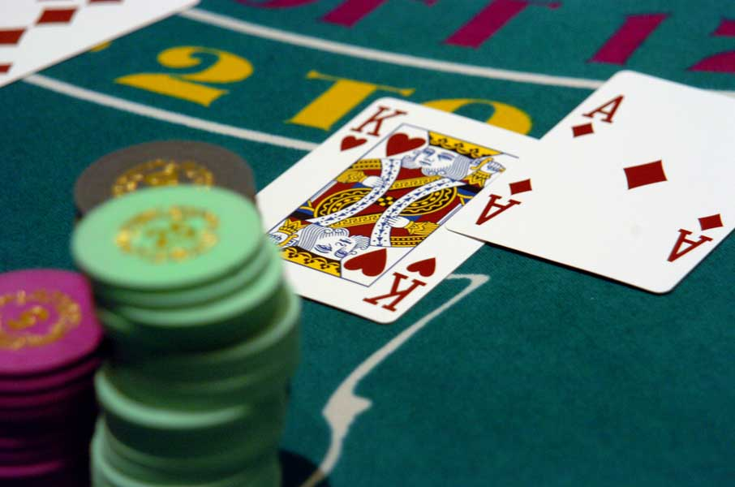
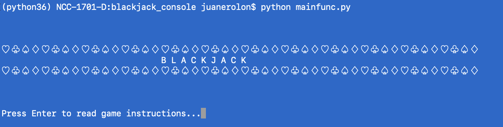
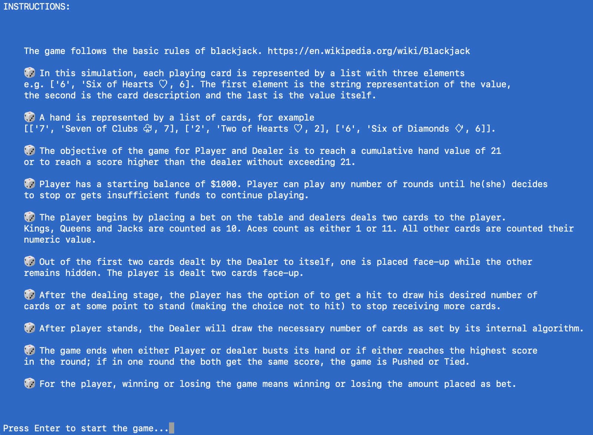
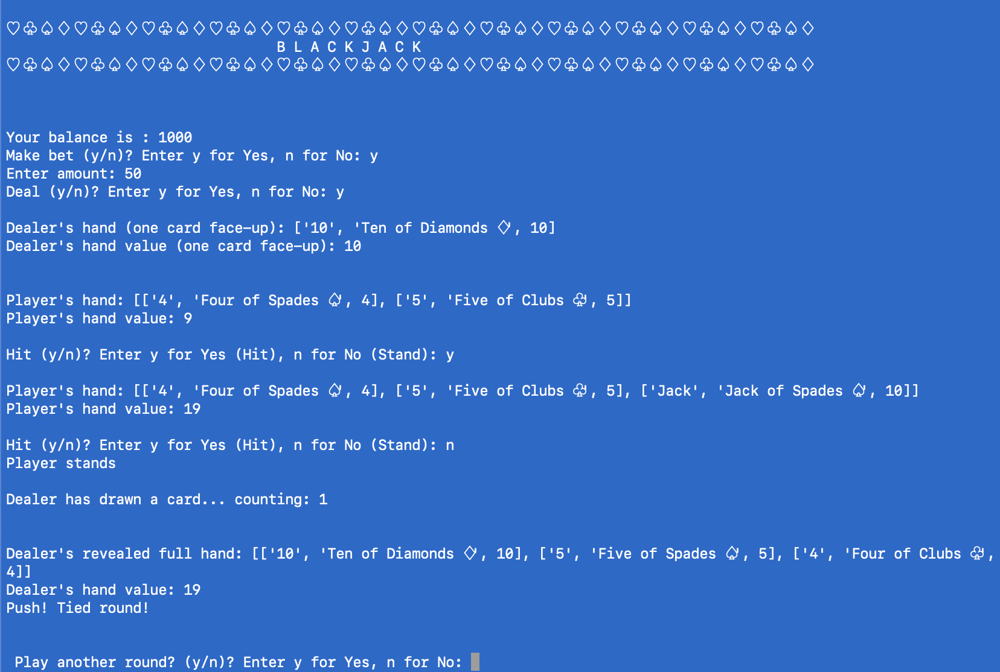

# Blackjack

### Juan E. Rolon

https://www.juanrolon.com

https://github.com/juanerolon

This is a demo project that implements the Casino game Blackjack using a Unix console interface. 

## Classes and modules:

- `deck.py` : Defines a 52-card playing deck for use in card games like Blackjack. Contains methods creating the deck representation, how cards are drawn and randomly shuffled.
    

- `bet.py` : Defines what is a bet in the game.


- `player.py` : Defines a Player object. Class member functions determine when player can continue hitting, the betting process, card update process and under which conditions he/she busts or gets blackjack.

- `dealer.py` : Defines a Dealer object. Class member functions determine when dealer can continue hitting, when it needs to stand (by the S17 rule), card update process and under which conditions it busts or gets blackjack. 


- `gameplay.py` :  Defines a Blackjack game object, attributes and methods that control the main decisions and dynamics of the game.


- `disp_intro.py` : Methods control and print header at start of game.

- `mainfunc.py` : Main function to execute. Defines and controls the main interface to user. Allows user to continue playing rounds of games if he/she has enough funds. Displays game stats after all rounds are completed.


### License

The present project constitutes original work licensed by GNU GPLv3. You are free to use, copy, read and adapt the source code to your needs provided you do not make exact copies without attribution to the entire source work as part of your product development. Any inquiries and suggestions for improvement are warmly welcomed. 

### Instructions

The program was tested in terminal/console shell within a Unix OS X Anaconda Python 3.6 environment. The classes and modules of the program make use of built-in and standard python packages, so it should run without issues in OS X and Linux. To run on Windows Powershell or CMD terminal make sure to replace os.system("clear") with os.system("cls") on every class of function that clears the console screen.  

To run the game from your shell or console:

`$ python mainfunc.py`

### Screenshots








```python

```
